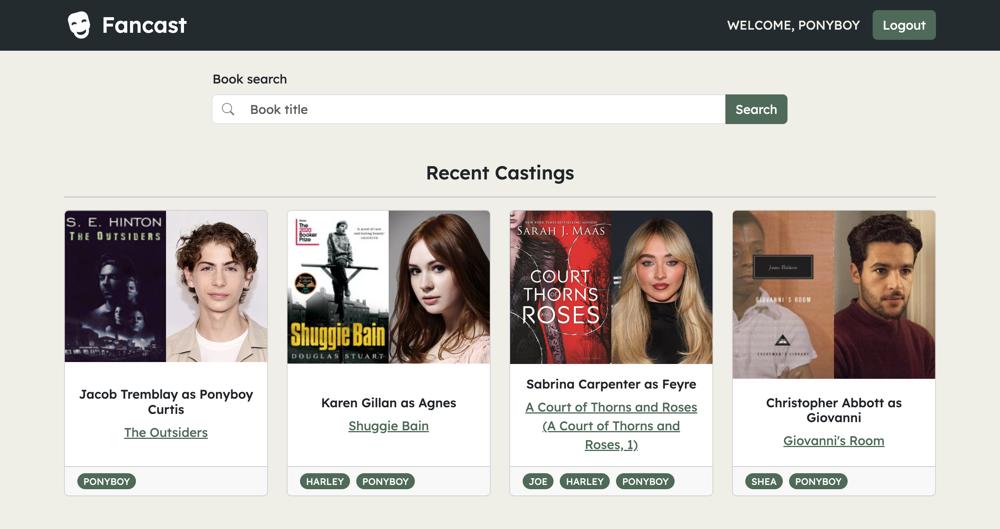

#  Fancast

🔗 Live site at [fancast.onrender.com](https://fancast.onrender.com/).

Fancast is a full-stack web application for selecting actors you would cast as characters in books. The home page displays recent castings that have been made -- unauthenticated users will see all recent castings, and logged in users will see their own latest selection of actors to play various characters.

You can search for a book whose characters you'd like to cast. On that book's page, any existing characters users have added for that book will display. If you're logged in, you can add any missing characters you'd like to cast!

Under each character, you can select an actor to play them that other users have selected, or add a new casting and search for any actor of your choosing.

## Technologies
- **ASP.NET Core** (**C#**) backend and API
- **PostgreSQL** database
- **React** (**TypeScript**) frontend
- **Bootstrap** styles toolkit

## Attributions
Fancast uses the [Google Books API](https://developers.google.com/books) for its book data and [The Movie Database](https://www.themoviedb.org/)'s API for its actor data.